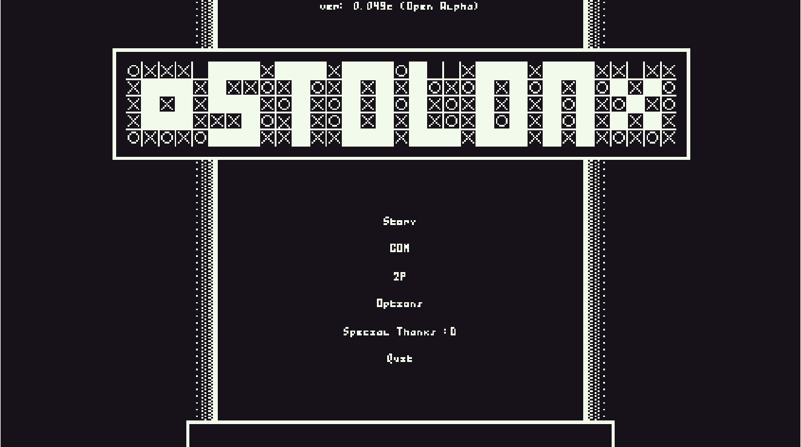
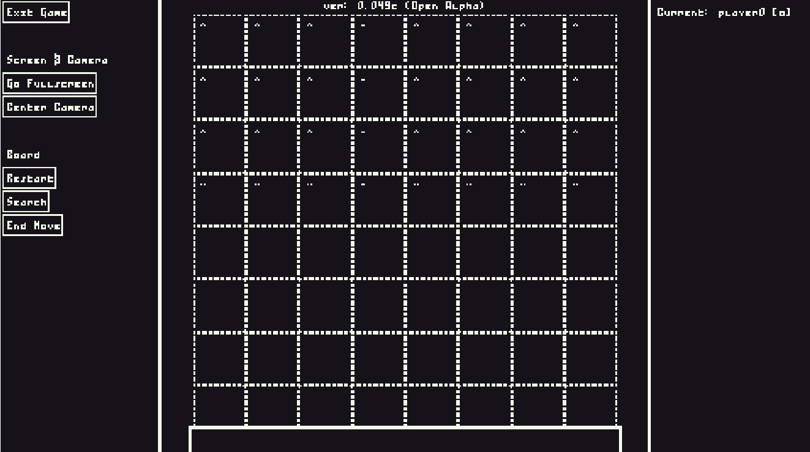
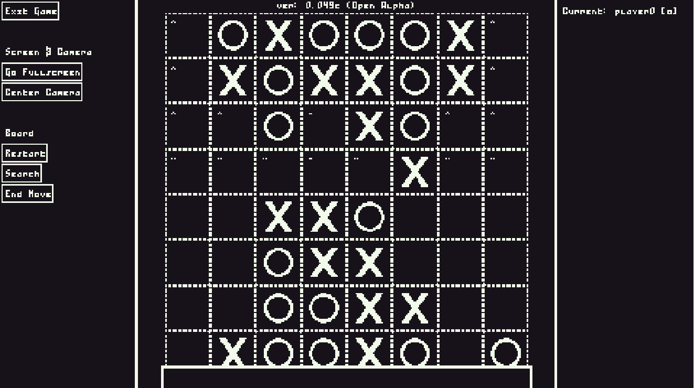
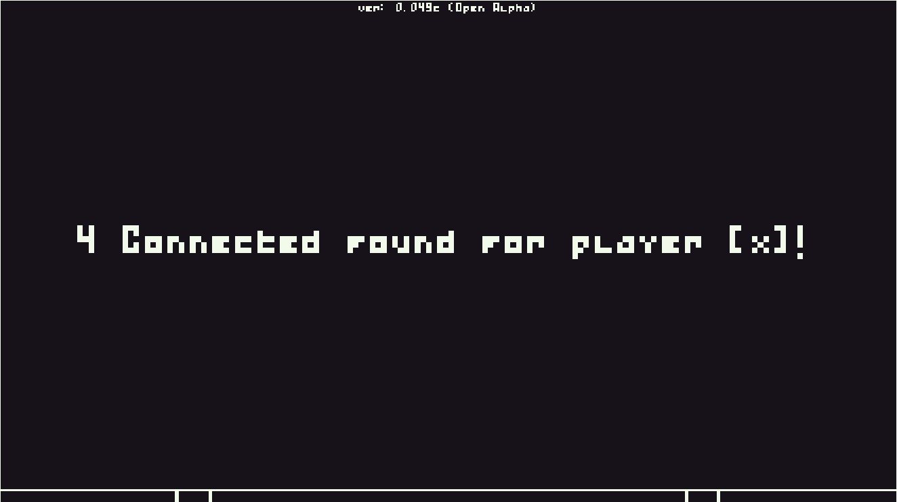

<h1 align="center">STOLON</h1>

<h4 align="center">A game that alters the classic "Four in a Row / Connect Four" formula to the point of being unrecognizable.</h4>

> [!NOTE]
> For planned features see the [STOLON Discord Server](https://discord.gg/Zm5tC42Kuu).

# Screenshots

The menu.

The board, top 4 layers have inverted gravity applied to them.

The board once more.

The transition screen after four connected are found.

# Install

Download the newest release from ["Releases"](https://github.com/JTnadrooi/Stolon/releases/) or the [STOLON Discord Server](https://discord.gg/Zm5tC42Kuu) and extract the **STOLON.zip** file. There an .exe will be found which will run the game.

## Controls

Key | Action
----|-------
F | Go fullscreen
Left Mouse | Place marker / Zoom in
Right Mouse | Zoom out / Drag camera
Shift | Zoom in
Shift + W/A/S/D | Move camera

## Buttons (In Board)

Button | Action
-------|-------
Exit game | Exit game
Go fullscreen | Go fullscreen
Restart | Clear board / Restart
Search | Search the board for four connected markers
Undo move | Undo's a move
End move | Skips a move

## Special thanks

Entity | For
---------|-------
Keescasual | Coming up with alot of the future ideas. Without him this game probably wouldn't exist.
LandonSC | Providing contructive feedback.
yuki | Providing great help with drawing most of the characters/Entities.
Voxuuu | Utmost critical feedback.

_And thank you for playing :D_

## P.S

> [!NOTE]
> When the itch.io page is up, this will have more info about the technical side of the game (making it mostly directed to modders.)